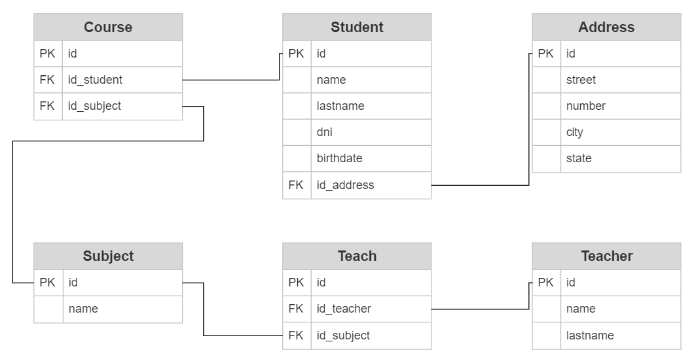

# Institute

El proyecto "Institute" es una plataforma de gestión educativa diseñada para simplificar la administración de estudiantes, profesores y materias.

## Características Principales:

- Registro y administración de estudiantes, profesores y materias.
- Asignación de profesores a materias y viceversa.
- Interfaz intuitiva y fácil de usar.

## Tecnologías Utilizadas:

- Backend: Java Spring Boot, Hibernate, H2, PostgreSQL
- Frontend: HTML, CSS, JavaScript
- Herramientas: Git, Postman

## Dependencias

- Spring Web
- Spring Data JPA
- H2
- Lombok
- Validation
- Log4j
- PostgresSQL

## Instrucciones para Levantar el Proyecto:

1. **Clonar el Repositorio:**

```bash
git clone git@github.com:luiz-22/institute.git
```

2. **Configuración de la Base de Datos:**

   - Crea una base de datos PostgreSQL.
   - Configura las credenciales de la base de datos en **src/main/resources/application-dev.properties**.

3. **Compilación y Ejecución:**

   - Abre el proyecto en tu IDE preferido.
   - Ejecuta la aplicación Spring Boot.

4. **Acceso a la Aplicación:**

   - La aplicación estará disponible en [http://localhost:8080](http://localhost:8080/).

5. **Uso de la Aplicación:**

   - Abre un navegador web y accede a la URL proporcionada.
   - Explora las diferentes funcionalidades de la aplicación.
   - Hay un par de funcionalidades no desarrolladas.

### Notas Importantes:

- Asegúrate de tener Java y PostgreSQL instalados en tu sistema.
- Puedes ajustar la configuración de la base de datos según tus necesidades.

## Modelo Entidad Relación



## Paso 1: Configuración del Proyecto

1. Abre Spring Initializr en tu navegador (https://start.spring.io/).
2. Selecciona las siguientes opciones:
   - Project: Maven
   - Language: Java
   - Spring Boot: (elige la versión más reciente)
   - Group: com.tuempresa
   - Artifact: nombredelproyecto
   - Dependencies: Selecciona "Spring Web", "Spring Data JPA" y "H2 Database" (puedes cambiar la base de datos más adelante si lo deseas).
3. Haz clic en el botón "Generate" para descargar el proyecto zip.

## Paso 2: Crear Entidades y DTO

Agregamos anotaciones así haga el mapeo con la base de datos.

```java
@Getter
@Setter
@NoArgsConstructor
@AllArgsConstructor
@Entity
@Table
public class Student {

    @Id
    @SequenceGenerator(name = "student_generator", allocationSize = 1, sequenceName = "student_generator")
    @GeneratedValue(strategy = GenerationType.SEQUENCE, generator = "student_generator")
    private Long id;

    private String name;
    private String lastname;
    private int dni;
    private LocalDate birthdate;

    @OneToOne(fetch = FetchType.EAGER, cascade = CascadeType.ALL)
    @JoinColumn(name = "id_address")
    private Address address;

    @OneToMany(mappedBy = "student", cascade = CascadeType.ALL)
    @JsonIgnore
    private Set<Course> listCourses;
}
```

Este código en Java es una definición de una entidad llamada "Student" (Estudiante) que será mapeada a una tabla en una base de datos a través de JPA (Java Persistence API), que es una especificación de Java para el manejo de persistencia de datos en aplicaciones de Java.

1. **Anotaciones de Lombok:**

   - **@Getter** y **@Setter:** Anotaciones de Lombok para generar automáticamente los métodos getter y setter para los campos de la entidad.
   - **@NoArgsConstructor:** Anotación de Lombok que genera un constructor sin argumentos.
   - **@AllArgsConstructor:** Anotación de Lombok que genera un constructor con todos los argumentos.

2. **Anotaciones de JPA:**
   - **@Entity:** Indica que esta clase es una entidad JPA y debe ser mapeada a una tabla en la base de datos.
   - **@Table:** Permite especificar detalles sobre la tabla que se utilizará para almacenar los datos de la entidad. En este caso, se utilizará el nombre de la clase como nombre de la tabla.
   - **@Id**: Indica que el campo siguiente es la clave primaria de la entidad.
   - **@SequenceGenerator:** Define un generador de secuencia que se utilizará para generar valores para la clave primaria.
   - **@GeneratedValue:** Indica que el valor de la clave primaria se generará automáticamente utilizando la estrategia definida en la anotación. En este caso, se utiliza una secuencia generada.
   - **@OneToOne** y **@JoinColumn:** Estas anotaciones definen una relación uno a uno con la entidad Address a través de la columna id_address en la tabla.
   - **@OneToMany** y **@JsonIgnore:** Definen una relación uno a muchos con la entidad Course, donde un estudiante puede tener varios cursos. La anotación @JsonIgnore evita que se serialicen los datos de los cursos cuando se convierte la entidad en JSON, para evitar ciclos infinitos de serialización.

En resumen, este código define una entidad JPA llamada **Student** que representa a un estudiante en una aplicación. La entidad tiene campos que corresponden a las propiedades del estudiante, como su nombre, apellido, fecha de nacimiento, etc. También establece relaciones con otras entidades como **Address** y **Course**.

```java
@Getter
@Setter
@NoArgsConstructor
@AllArgsConstructor
public class StudentDTO {
    private Long id;
    private String name;
    private String lastname;
    private int dni;
    private LocalDate birthdate;
    private AddressDTO address;  // Utiliza el DTO de Address en lugar de la entidad
}
```

## Paso 3: Crear Repositorios

Necesitamos que extienda de la interfaz **JpaRepository**. Esta interfaz es parte de la capa de acceso a datos (Data Access Layer) y se utiliza para interactuar con la base de datos y realizar operaciones relacionadas con la entidad **Student**.

```java
@Repository
public interface IStudentRepository extends JpaRepository<Student, Long> {
}
```

1. **@Repository:** La anotación **@Repository** es parte del framework de Spring y se utiliza para indicar que esta interfaz es un componente que manejará el acceso a datos y proporcionará métodos para interactuar con la base de datos. Esta anotación ayuda a Spring a detectar automáticamente la interfaz y crear una instancia gestionada para su uso en la inyección de dependencias.

2. **IStudentRepository:** Esta es la interfaz que define la abstracción para operaciones de acceso a datos relacionadas con la entidad **Student**.

3. **JpaRepository< Student, Long>:** **JpaRepository** es una interfaz proporcionada por Spring Data JPA que proporciona métodos predefinidos para realizar operaciones CRUD (Crear, Leer, Actualizar, Eliminar) en la base de datos relacionados con la entidad especificada. En este caso, se está utilizando para la entidad **Student**.
   - Student: Es el tipo de entidad con la que esta interfaz se relaciona.
   - Long: Es el tipo de dato del campo de la clave primaria de la entidad (id en este caso).

Esto significa que, al extender **JpaRepository< Student, Long>**, la interfaz **IStudentRepository** heredará una serie de métodos predefinidos, como **save**, **findById**, **findAll**, **delete**, etc. Estos métodos pueden ser utilizados directamente sin necesidad de implementarlos manualmente, lo que facilita la interacción con la base de datos y reduce la cantidad de código repetitivo.

En resumen, la interfaz **IStudentRepository** se encarga de definir los métodos necesarios para realizar operaciones de acceso a datos relacionadas con la entidad **Student**, y al extender **JpaRepository**, se obtienen automáticamente implementaciones predeterminadas de estos métodos proporcionados por Spring Data JPA.

## Paso 4: Crear Servicios

Tenemos que programar por cada entidad la correspondiente clase de servicio. Es una buena práctica que también se implemente una interfaz.

```java
public interface IStudentService {
    void createStudent(StudentDTO studentDTO);
    StudentDTO getStudent(Long id);
    void updateStudent(StudentDTO studentDTO);
    void deleteStudent(Long id);
    Set<StudentDTO> getAll();
}
```

```java
@Service
public class StudentService implements IStudentService {

    @Autowired
    private IStudentRepository studentRepository;

    @Autowired
    private ObjectMapper mapper;

    @Override
    public void createStudent(StudentDTO studentDTO) {
        Student newStudent = mapper.convertValue(studentDTO, Student.class);
        studentRepository.save(newStudent);
    }

    @Override
    public StudentDTO getStudent(Long id) {
        Optional<Student> student = studentRepository.findById(id);
        return student.map(value -> mapper.convertValue(value, StudentDTO.class)).orElse(null);
    }

    @Override
    public void updateStudent(StudentDTO studentDTO) {
        Student updatedStudent = mapper.convertValue(studentDTO, Student.class);
        studentRepository.save(updatedStudent);
    }

    @Override
    public void deleteStudent(Long id) {
        studentRepository.deleteById(id);
    }

    @Override
    public Set<StudentDTO> getAll() {
        List<Student> allStudents = studentRepository.findAll();
        Set<StudentDTO> allStudentDTO = new HashSet<>();

        for (Student student : allStudents) {
            allStudentDTO.add(mapper.convertValue(student, StudentDTO.class));
        }

        return allStudentDTO;
    }
}
```

La clase **StudentService** se encarga de gestionar las operaciones relacionadas con los estudiantes, utilizando el repositorio IStudentRepository para acceder a la base de datos.

1. **@Service:** La anotación **@Service** es parte del framework de Spring y se utiliza para indicar que esta clase es un componente de servicio. Los servicios son responsables de implementar la lógica empresarial y coordinar la interacción entre controladores y repositorios.
2. **Inyección de Dependencias:**
   - **@Autowired private ObjectMapper mapper;:** Similarmente, se inyecta una instancia de ObjectMapper, que es una clase de Jackson utilizada para mapear objetos Java a JSON y viceversa. Esto se utiliza para convertir objetos DTO a entidades Student y viceversa.
3. **Métodos de Servicio:**
   - **createStudent(StudentDTO studentDTO):** Este método toma un objeto StudentDTO (DTO = Data Transfer Object) como argumento, lo convierte a una entidad Student utilizando el ObjectMapper y luego guarda el estudiante en la base de datos utilizando el repositorio.
   - ...

En resumen, la clase **StudentService** encapsula la lógica empresarial para gestionar operaciones relacionadas con los estudiantes, convirtiendo entre objetos DTO y entidades **Student** utilizando **ObjectMapper**, y accediendo a la base de datos a través del repositorio **IStudentRepository**.

## Paso 5: Crear Testeo unitario

Me paro sobre la clase para crear un test.

```java
@SpringBootTest
public class StudentServiceTest {

    @Autowired
    private IStudentService studentService;

    @Autowired
    private IStudentRepository studentRepository;

    @BeforeEach
    void setUp() {
        // Realizar cualquier configuración necesaria antes de cada prueba
    }

    @Test
    void createStudent() {
        StudentDTO studentDTO = new StudentDTO();
        studentDTO.setName("John");
        studentDTO.setLastname("Doe");
        studentDTO.setDni(12345678);
        studentDTO.setBirthdate(LocalDate.of(2000, 1, 1));

        studentService.createStudent(studentDTO);

        Student retrievedStudent = studentRepository.findById(1L).orElse(null);

        assertNotNull(retrievedStudent);
        assertEquals(studentDTO.getName(), retrievedStudent.getName());
        // Aquí puedes agregar más comprobaciones según tu lógica de negocio
    }

    @Test
    void getStudent() {
        StudentDTO studentDTO = new StudentDTO();
        studentDTO.setName("John");
        studentDTO.setLastname("Doe");
        studentDTO.setDni(12345678);
        studentDTO.setBirthdate(LocalDate.of(2000, 1, 1));

        studentService.createStudent(studentDTO);

        StudentDTO retrievedStudent = studentService.getStudent(1L);

        assertNotNull(retrievedStudent);
        assertEquals(studentDTO.getName(), retrievedStudent.getName());
        // Aquí puedes agregar más comprobaciones según tu lógica de negocio
    }

    // Agrega aquí más pruebas para los otros métodos del servicio
}
```

Este es un conjunto de pruebas unitarias para la clase StudentService utilizando el framework de pruebas JUnit junto con las capacidades de Spring Boot. 

## Paso 6: Crear Controladores

```java
@RestController
@RequestMapping("/students")
public class StudentController {

    @Autowired
    IStudentService studentService;

    @PostMapping
    public ResponseEntity<?> createStudent(@Valid @RequestBody StudentDTO studentDTO) {
        studentService.createStudent(studentDTO);
        return ResponseEntity.ok(HttpStatus.OK);
    }

    @GetMapping("/{id}")
    public StudentDTO getStudent(@PathVariable Long id) {
        return studentService.getStudent(id);
    }

    @PutMapping
    public ResponseEntity<?> updateStudent(@Valid @RequestBody StudentDTO studentDTO) {
        studentService.updateStudent(studentDTO);
        return ResponseEntity.ok(HttpStatus.OK);
    }

    @DeleteMapping("/{id}")
    public ResponseEntity<?> deleteStudent(@PathVariable Long id) {
        studentService.deleteStudent(id);
        return ResponseEntity.ok(HttpStatus.OK);
    }

    @GetMapping
    public Set<StudentDTO> getAll() {
        return studentService.getAll();
    }
}
```

1. **@RestController:** Esta anotación se utiliza para indicar que esta clase es un controlador REST. Un controlador REST es responsable de manejar las solicitudes HTTP y devolver respuestas en formato JSON.

2. **@RequestMapping("/students"):** Esta anotación se coloca en la clase a nivel de clase y establece la ruta base para todas las solicitudes manejadas por este controlador. En este caso, todas las rutas estarán bajo "/students".

3. **Métodos de Controlador:**

   - **createStudent(@Valid @RequestBody StudentDTO studentDTO):** Este método maneja solicitudes POST en la ruta "/students". Toma un objeto **StudentDTO** del cuerpo de la solicitud, lo valida utilizando la anotación **@Valid** y luego llama al método createStudent() del servicio para crear un nuevo estudiante. Devuelve una respuesta ResponseEntity con un estado HTTP OK.
   - **getStudent(@PathVariable Long id):** Este método maneja solicitudes GET en la ruta "/students/{id}". Toma un parámetro de ruta **id** que se utiliza para identificar al estudiante. Llama al método **getStudent()** del servicio para obtener los detalles del estudiante y devuelve un objeto **StudentDTO** en formato JSON.
   - ...

En resumen, el **StudentController** se encarga de mapear las solicitudes HTTP a operaciones en el servicio **IStudentService** correspondiente. Cada método del controlador se relaciona con una operación CRUD (Crear, Leer, Actualizar, Eliminar) en los estudiantes y devuelve respuestas HTTP adecuadas.

## Paso 7: Manejo de errores

Construiremos una clase que se encargue de capturar todos los errores de manera glogal y los guarde en un log. 

Vamos a crear una archivo **log4j.properties** que se utiliza para configurar y personalizar la forma en que se registran los eventos de registro (logs) utilizando la biblioteca Log4j. 

```log4j
log4j.rootLogger=DEBUG, file
log4j.logger.infoLogger=DEBUG
log4j.additivity.infoLogger=false
log4j.appender.file=org.apache.log4j.RollingFileAppender
log4j.appender.file.File=institute_errors.log
log4j.appender.file.MaxFileSize=5MB
log4j.appender.file.MaxBackupIndex=10
log4j.appender.file.layout=org.apache.log4j.PatternLayout
log4j.appender.file.layout.ConversionPattern=[%d{yyyy-MM-ddHH:mm:ss}] [ %-5p] [%c{1}:%L] %m%n
```

Creamos el archivo **institute_errors.log**.

Luego vamos a la clase donde tenemos el **main** y agregamos:

```java
PropertyConfigurator.configure("log4j.properties");
```

Ahora creamos la clase que va a menejar los errores.

```java
@ControllerAdvice
public class GlobalExceptionHandler {

    private static final Logger logger = Logger.getLogger(GlobalExceptionHandler.class);

    @ExceptionHandler(Exception.class)
    public ResponseEntity<?> allError(Exception ex, WebRequest req) {
        logger.error(ex.getMessage());
        return new ResponseEntity("ExceptionHandler Error " + ex.getMessage(), HttpStatus.INTERNAL_SERVER_ERROR);
    }
}
```

- **@ControllerAdvice:** Esta anotación se utiliza en Spring para definir una clase que manejará excepciones de manera global en toda la aplicación. En otras palabras, cualquier excepción lanzada desde los controladores de la aplicación será capturada por esta clase de manejo de excepciones global.
- **@ExceptionHandler(Exception.class):** Esta anotación se utiliza para indicar que el método siguiente manejará excepciones del tipo Exception (y sus subtipos). En otras palabras, este método se ejecutará cuando se produzca cualquier excepción en los controladores de la aplicación.

- **public ResponseEntity<?> allError(Exception ex, WebRequest req):** Este es el método que manejará las excepciones. Toma dos argumentos:
  - **ex:** La excepción que se ha lanzado.
  - **req:** La solicitud web asociada a la excepción.
-**logger.error(ex.getMessage());:** Aquí se registra un mensaje de error en el logger que se creó al principio de la clase. Se registra el mensaje de la excepción utilizando el método **error** del logger.
- **return new ResponseEntity("ExceptionHandler Error " + ex.getMessage(), HttpStatus.INTERNAL_SERVER_ERROR);:** Se devuelve una entidad **ResponseEntity** que contiene información sobre el error. Se incluye el mensaje de error de la excepción en la respuesta, junto con un estado HTTP 500 (Internal Server Error), indicando que ha ocurrido un error en el servidor.

También puedo crear una clase de excepción personalizada.

```java
public class BadRequestException extends Exception {
    public BadRequestException(String message) {
        super(message);
    }
}
```

## Paso 8: Crear consultas HQL

Podemos crear consultas según nuestras necesidades.

```java
@Repository
public interface IStudentRepository extends JpaRepository<Student, Long> {

    @Query("from Student s where s.dni like :dni")
    Student getStudentByDNI(@Param("dni") int dni);

    @Query("from Student s where s.lastname like %:lastname%")
    Set<Student> getStudentByLastnameLike(@Param("lastname") String lastname);
}
```

**@Query** se utiliza para definir una consulta personalizada utilizando el lenguaje de consulta de Spring Data JPA (basado en HQL - Hibernate Query Language). 

## Paso 9: Crear Front-end

En este caso creamos un sencillo front-end solo con html y js.

## Pasos extras

- Cambiar de base de datos si lo requirimo
- Seguridad (Login con Spring Security)
- Prueba de integración
- Documentación (Swagger)

## Contacto:

Si tienes preguntas o comentarios, no dudes en contactarme a través de mi [LinkedIn](https://www.linkedin.com/in/luiz22/) o [GitHub](https://github.com/luiz-22).
